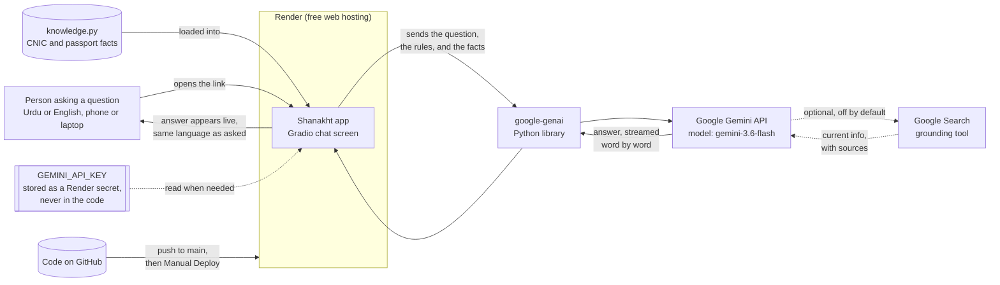

# The Shanakht Journey

This document tells the story of Shanakht. What it is, why we built it, how we built
it, what tools we picked and why, what went wrong along the way, and where it stands
today. It is written to be read start to finish, like a story, and it is meant to help
build the presentation for the hackathon.

**Live app:** https://shanakhtapp.onrender.com
**Code repo:** https://github.com/mshafiq92/ShanakhtApp
**Full requirements document (PRD):** https://github.com/mshafiq92/ShanakhtApp/blob/main/docs/Shanakht_PRD.md

---

## 1. Where the idea started

Shanakht means recognition or identity in Urdu. The project was built for the
PakAngels GenAI and Agentic AI Training Program hackathon.

The starting problem is simple to say and annoying to live through. Every adult in
Pakistan needs a CNIC. Most people also need a passport at some point. Getting either
one is not hard in theory. In practice, people are not sure which card type applies to
them, what documents to bring, what the real fee is right now, or how the process
works if they live abroad.

The information is public. NADRA and DGIP both publish it. But it is spread across
different pages, mostly in English, and written the way a government office writes,
not the way a normal person talks. So people ask around, they trust rumors, they pay
an agent to do something they could have done themselves for free, or they show up at
an office without the right papers and have to come back another day.

We picked this problem because it touches almost everyone, it maps well to United
Nations Sustainable Development Goal 16, target 16.9, which is about legal identity
for all, and it is a genuinely useful thing to build with a language model. A chatbot
that reads plain government rules and explains them back in simple Urdu or English is
a good fit for what these tools are actually good at.

---

## 2. Why we built it this way

The team had one hard constraint from the start. There was no document collection to
search through, so a standard retrieval system, the kind that searches a pile of PDFs,
was not an option. Instead, the plan was to write the real facts ourselves, once,
carefully, and hand them to the model as part of its instructions every time it
answers. This is simpler to build, easier to check for accuracy, and easy for a non
technical person to edit later, since it is just one text file.

The bot was designed around a small number of firm rules from day one:

- Answer from the written facts, plus well known public knowledge about these two
  topics only. Never invent a fee or a rule.
- Never confuse NADRA, which issues the CNIC, with DGIP, which issues the passport.
- Reply in the same language the person used. Urdu in, Urdu out. English in, English
  out.
- Any step by step process gets numbered steps, not a wall of text.
- Any fee, timeline, or full process comes with a short reminder to check the
  official website, since these numbers change.
- Never ask for a CNIC number, passport number, or OTP, and gently warn a user who
  shares one anyway.

These rules live in the system prompt in the code, and they held up through every
change we made later.

---

## 3. The tools, and why each one

**Gradio**, for the chat screen. It gives a working, streaming chat interface in a
few lines of Python, which matters a lot on a hackathon clock. No separate frontend
project, no separate backend API to wire up by hand.

**Google Gemini**, through the official `google-genai` Python library, as the
language model. It has a free usage tier, it is genuinely strong at both Urdu and
English, and it supports an optional live web search tool that can ground an answer
in current information when needed.

**A plain Python file as the knowledge base.** All the CNIC and passport facts live
in one file called `knowledge.py`, as a big block of text. No database, no vector
search, no extra moving parts. Someone who has never written code can open this file,
find the fee they want to fix, and edit it directly.

**Claude Code**, as the development partner for the whole build. This document you
are reading, the fixes described below, the tests, and the deployment steps were all
done through an AI assisted, conversational development process. This is itself part
of the story, since the hackathon program is specifically about GenAI and agentic AI,
and this project used that approach to build itself, not just to answer questions
inside the app.

**GitHub**, for source control, and **Render**, for hosting. More on why Render in
section 6, since the original plan was different.

---

## 4. Building it, step by step

The build followed a simple path, working in small, tested pieces instead of one big
change.

**Step one, get the facts right.** The starting knowledge file had placeholder tags
like "confirm this fee" scattered through it. Before writing a single new feature, we
tracked down real numbers. Passport fees came straight from the official DGIP website.
CNIC fees, the family certificate fee, and the current way to check how many SIM
cards are on your CNIC came from cross checking several independent public sources,
since NADRA's own site blocks automated page reading. Every number in the file now
has a note on where it came from, so a future reader knows how much to trust it.

**Step two, add optional live web search.** Gemini has a built in tool that lets it
search Google before answering, so it can catch a fee change that happened after this
knowledge file was written. We wired this in behind a simple on or off setting, and
added a short "Sources" list under any answer that actually used it.

**Step three, polish the chat screen.** The first working version was plain. We added
a proper title with a small logo, a description that makes clear this is a helper and
not an official source, a balanced set of Urdu and English example questions, and a
short welcome message telling people they can type in either language.

**Step four, get the repository ready to share.** This meant a `.gitignore` file so
secrets and cache files never get committed, a careful search through the whole repo
for anything that looked like a real key, and an accurate README file.

**Step five, put it online with a public link.** Covered in detail in section 6,
since this step did not go the way the original plan expected.

**Step six, testing and demo material.** A simple checklist of questions anyone can
run by hand against the live app, a small set of automated checks that confirm the
code plumbing works without needing a real API key, and a short spoken script for the
live demo. These live in `docs/TEST_CHECKLIST.md`, `test_app.py`, and
`docs/DEMO_SCRIPT.md`.

---

## 5. Bumps along the way, and what we learned

A few real problems came up during the build. Each one taught us something, and each
one is now handled in the code or documented so it does not repeat.

**The model name went away mid build.** `gemini-2.5-flash` was retired by Google
while we were testing. The fix was simple, use the newer model the error message
itself pointed us to, but it is a good reminder that a hackathon project depending on
a hosted model needs to check the model name still works before every demo.

**A chat history bug only showed up on the second message.** Gradio changed how it
stores a conversation's history between versions. The first message in any chat
always worked, but the second one crashed, because the code expected plain text and
Gradio was now sending a small structured object instead. This is exactly the kind of
bug that is easy to miss if you only test with one message, so a lesson here is to
always test a real back and forth conversation, not just a single question.

**Live web search needed a paid account.** As of January 2026, Google started
requiring a billing linked project to use its search grounding tool, even though a
generous free amount is included before any charge applies. Since the project's goal
is to run on free tools with no cost, this feature now defaults to off, and turning
it on is a deliberate choice, not the default.

---

## 6. Getting it online, and why the plan changed

The original plan, written in the project's requirements document, was to host on
Hugging Face Spaces. That plan made sense at the time. It is a well known, simple way
to host exactly this kind of chat app for free.

While building this, Hugging Face changed its policy. As of the middle of 2026, a
Space that runs a Gradio app on their free compute tier now needs a paid plan. Static
pages are still free, but a live Python app like ours is not, unless the account
qualifies for a separate, more limited free allowance that turned out not to be
available on this account.

We looked at a second option, a platform called Koyeb. It also offers a free tier for
small apps. But partway through setting it up, it became clear that Koyeb had just
been bought by another company and was in the middle of turning into a different kind
of product. Signing up in the middle of that change felt risky for something that
needs to be reliably online for judging.

We settled on **Render**, a well established hosting service with a real free tier
for small web apps. Render still asks for a card on file before it will deploy even a
free service. This is a one dollar temporary hold to prove the card is real, not an
actual charge, and it does not change the fact that the hosting itself stays free.
This kind of check has become common across almost every free hosting option in
2026, as a way to stop people from abusing free computers for things like crypto
mining.

One more small fix was needed once we were on Render. Render's default Python version
was very new, new enough that some of the app's dependencies did not yet have ready
made installers for it, which made the first build painfully slow. Pinning the
project to Python 3.12, a well supported and stable version, fixed this completely,
and later builds finished in under two minutes.

The result is a live, public, free to run chatbot at
https://shanakhtapp.onrender.com.

---

## 7. Why the free app sometimes takes a moment to load

Render's free plan does not keep an app running all the time. If nobody visits the
app for a while, Render turns it off completely to save resources for everyone
sharing the free tier. Nothing is lost when this happens. The code and the settings
are still there.

The moment someone opens the link again, Render notices nothing is running, starts a
fresh copy of the app, waits until it is ready, and then shows that visitor the page.
This first visit after a quiet period can take somewhere between thirty seconds and a
minute. Every visitor after that gets the normal, fast experience, until the app goes
quiet again and the cycle repeats.

For a live demo, the simple fix is to open the link a few minutes before going on
stage, so the app is already awake by the time anyone needs to see it.

---

## 8. Where things stand right now

- The app is live and working at https://shanakhtapp.onrender.com, hosted for free on
  Render.
- The code is on GitHub at https://github.com/mshafiq92/ShanakhtApp.
- The knowledge base covers CNIC and passport basics, new applications, renewals,
  modifications, lost cards, overseas services, fees, tracking, and safety tips, with
  real researched figures instead of placeholders.
- Live web search grounding exists in the code and works, but stays off by default
  for cost reasons, and can be turned on with one setting once a billing account is
  linked.
- The chat screen is bilingual by design, shows Urdu text correctly right to left,
  and works on both desktop and phone screens.
- A test checklist, a small automated test file, and a demo script are ready to use.

---

## 9. System architecture

In plain words: a person types a question into the chat screen. The app adds that
question to the running conversation, along with the fixed rules and the whole
knowledge file, and sends all of it to Google's Gemini model. The model is not
searching a database. It is reading the rules and the facts as part of its
instructions every single time, the same way you might hand someone a fact sheet
before asking them a question. If web search is turned on and the model decides it is
useful, it can also check Google Search before answering, and list its sources. The
answer streams back to the chat screen as it is written, so the person sees words
appearing right away instead of waiting for the whole answer at once.

The API key needed to talk to Google is stored as a secret setting on Render, never
written into the code itself, and never pushed to GitHub.

---

## 10. What changed from the original plan, in one table

| Planned | What actually happened | Why |
|---|---|---|
| Host on Hugging Face Spaces | Hosted on Render instead | Hugging Face made Gradio Spaces a paid feature partway through 2026 |
| `gemini-2.5-flash` model | `gemini-3.6-flash` | The older model was retired by Google during the build |
| Web search grounding on by default | Off by default, one setting to enable | Google now requires a billing linked account for this feature |
| Placeholder fee figures | Real, sourced figures | Researched from official sites and cross checked public sources before launch |
| Default Python version on host | Pinned to Python 3.12 | The host's newer default made builds very slow |

---

This is where the project stands today. The next steps, cleaning up files that are no
longer needed and finishing the presentation, build directly on everything above.
